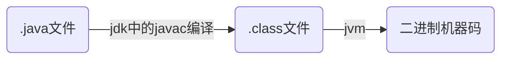
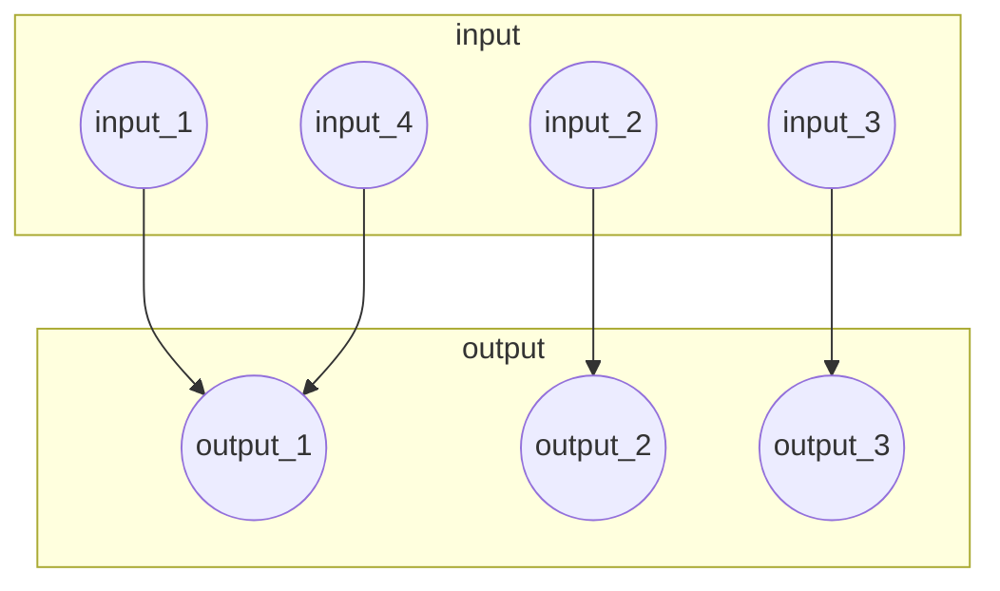

### 1. Jvm jdk jre

#### 1.1 jvm

> java虚拟机是运行java字节码的虚拟机，针对不同的系统有特定的实现，是为了使用相同的字节码文件，它们都会给出相同的结果

##### 什么是字节码？采用字节码的好处是什么？

> java中，jvm可以理解的代码叫做 ==字节码== （扩展名为==.class==的文件），它只面向虚拟机。通过采用字节码的方式，在一定程度上解决了传统解释型语言执行效率低的问题，同时又保留了解释型语言可移植的特点。

##### java程序从源代码到运行的3个步骤



> 在.class 文件 -> 机器码这一步，jvm类加载器首先加载字节码文件，然后通过解释器逐行解释执行，这种方式的执行速度会相对比较慢。而且，有些代码块是经常被调用的（==HotSpot==），所以后面就引进了==JIT==编译器，这属于运行时编译。当JIT编译器完成第一次编译后，会将字节码对应的机器码保存下来，下次可以直接使用。而我们知道，机器码的执行效率肯定是高于java解释器的

#### 1.2 jre

> jre 是java运行时环境，它是运行==已编译==java程序所需的所有内容的集合，包括JVM、java类库，java命令和其他的一些基础构件

#### 1.3 jdk

> jdk拥有jre所有的一切，还有编译器 ==javac== 和工具（比如==javadoc==和==jdb==）

为什么说java语言”编译与解释并存“

> java源文件要进行编译转成.class文件，再由jvm解释执行

### 2. 自增自减运算符

> 前缀表示先自增/减，然后赋值
>
> 后缀表示先赋值，再自增/减

### 3. java泛型、类型擦除

> generics 提供了编译时类型安全检测机制，该机制允许程序员在编译时检测到非法的类型
>
> java中的泛型是伪泛型，这是因为java在编译期间，所有的泛型信息都会被擦掉，这就是类型擦除

### 4. == equals hashCode

> - == 比较两个对象的内存地址是否相等
>
> - equals: 超类Object中的equals实际上用的是== , 可以根据业务逻辑重写
> - hashCode: 返回对象的hash值，重写equals后该值也必须要重写
>
> 规定：==两个对象相等，哈希值一定相等。哈希值不等，两个对象一定不等。==对象不等，哈希可能相等，哈希相等，对象可能不等
>
> 以set为例，判断元素是否等，是先判断hashcode是否等，如果不等，则认为元素不等了；如果等，再调用equals看内容
>
> 为什么重写equals一定要重写hashCode？
>
> 底层原因是因为HashSet或map等集合中判断元素是否相等用到了hashcode是否相等，为了避免我们认为相等但是逻辑判断不等的情况出现，自定义重写equals一定要重写hashcode
>
> ==记住java中涉及hashcode判断的步骤：1.hashcode不等，对象肯定不等，不进行下一步的判断了；2.hashcode相等的情况下，再进行内容的判断==
>
> 假设这样的情况，重写了equals但是没有重写hashCode
>
> 因为Object中的hashcode是根据地址计算出来的，所以肯定不一样

##### 散列函数

> Hash function 又称散列算法，哈希函数。所有的哈希函数都有一个基本特性：==如果两个散列值是不一样的，那么这两个散列值的原始输入也是不相同的==。
>
> hash collision：散列冲突、散列碰撞，两个不同的输入但是却输出了同样的散列值。也就是说散列值一样的，输入可能一样，也有可能不一样。这是很容易理解的，因为散列算法是一种压缩算法，是一种降维算法，输入的数目是多于输出的数目的，这就不可避免有一些不同的输入得到了一样的输出。



### 5. 基本数据类型

#### 5.1 java中的基本数据类型 --> 对应的包装类型 --> 占用的字节大小

> java中有8中基本数据类型，分别是：
>
> 	1. 6钟数字类型：byte, short, int, long. float, double
>  	2. 1种字符类型：char
>  	3. 1种布尔型：boolean
>
> 对应的包装类型分别是：Byte, Short, Integer, Long, Float, Double, Character, Boolean
>
> | 基本类型 | 位数 | 字节 | 默认值  |
> | :------: | :--: | :--: | :-----: |
> |   byte   |  8   |  1   |    0    |
> |  short   |  16  |  2   |    0    |
> |   int    |  32  |  4   |    0    |
> |   long   |  64  |  8   |   0L    |
> |  float   |  32  |  4   |   0f    |
> |  double  |  64  |  8   |   0d    |
> |   char   |  16  |  2   | 'u0000' |
> | boolean  |  1   |      |  false  |
>
> -----
>
> #### ascii, unicode, utf-8码
>
> ##### ascii
>
> 一个byte有8个bit，一共有256种状态
>
> ascii码一共规定了128个字符，用了一个字节的后面7个bit位，最前面的一位同一规定为0
>
> ##### unicode
>
> 128个字符对于英语来说足够用了，但是对于很多语言来说，却是不够用的。因此定义了一套容纳更多字符的编码集，万国码，unicode
>
> ##### utf-8
>
> utf-8是unicode的实现方式之一，规定了采用什么方式使用unicode编码集，这是一种编码方式
>
> -----------
>
> 回到正题，为什么char的默认值是’u0000‘，这在unicode中表示空字符

#### 5.2 自动装箱和拆箱

- **「装箱」**：将基本类型用它们对应的引用类型包装起来
- **「拆箱」**：将包装类型转换为基本数据类型

为什么要有装箱和拆箱呢？？？？

> ==把一个基本类型包装成一个类，可以使这个类型具有很多可以调用的方法==
>
> 基础类型是==数据==，不是对象，也不是Object的子类，需要装箱才能和其他Object子类共用同一个接口

### 6. 方法（函数）

#### 6.1 为什么java中只有值传递

> java程序中总是采用值传递，也就是说，方法的得到的是所有参数值得一份拷贝，也就是说，方法不能修改传递给它的任何参数变量的内容

实现一个改变对象参数状态的方法并不是一件难事。理由很简单，方法得到的是==对象引用的拷贝==，对象引用及其他的拷贝==同时引用同一个对象==

### 7. 重载和重写的区别

> - **「重载」**：就是同样的一个方法能够根据输入数据的不同，做出不同的处理。==同一个类中多个同名方法根据不同的传参来执行不同的逻辑处理==
>
> - **「重写」**：当子类继承自父类的相同方法，输入数据一样，但是要做出有别于父类的响应时，就需要覆盖父类的方法。==子类对父类方法的重新改造，外部样子不能改变，内部逻辑可以改变==

### 8.类和对象

#### 8.1 面向对象和面向过程的区别

> - **「面向过程」**：面向过程性能比面向对象高。因为类调用时需要实例化，开销比较大，比较消耗资源，所以当性能是最重要的考量因素的时候，一般采用面向过程开发。但是，这种开发不易维护、复用、扩展
> - **「面向对象」**：易维护、复用、扩展，因为有封装、继承、多态的特性，所以可以设计出低耦合的系统，使系统更加灵活、更加易于维护，但是，面向对象性能比面向过程低

#### 8.2 构造器constructor是否可以被override

> Contructor 不能被override (重写)，但是可以overload(重载)，所以看到一个类中有多个构造函数的情况。

#### 8.3 在java中定义一个不做事且没有参数的构造方法的作用

> 在执行子类的构造方法之前，如果没有用super() 来调用父类特定的构造方法，则会调用父类中“没有参数的构造方法”。因此，如果父类中只定义了有参数的构造方法，而在子类的构造方法中又没有用super()来调用父类中特定的构造方法，则编译时将会发生错误，因为java程序在父类中没有找到没有参数的构造方法可以执行。解决方法时在父类里加上一个不做事且没有参数的构造方法。
>
> 如果我们自己添加了累的constructor，java就不会再添加默认的无参数的constructor了。如果我们重载了有参的constructor，记得把无参的constructor也写出来（无论是否用到）

#### 8.4 成员变量和局部变量的区别

> 1. 从语法形式看：成员变量是属于类的，而局部变量是在==方法==中定义的变量或是方法的参数；
> 2. 从变量在内存中的存储方式来看：如果成员变量是使用static修饰的，那么这个成员变量是属于类的，如果没有使用static修饰，这个成员变量是属于实例的，而对象存在于heap，局部变量则存在于stack
> 3. 从变量在内存中的生存时间上看：成员变量是对象的一部分，它随着对象的创建而存在，而局部变量随着方法的调用而自动消失
> 4. 成员变量如果没有被赋初值：则会自动以类型的默认值而赋值（一种例外的情况是：被final修饰的成员变量也必须显式赋值），而局部变量不会自动赋值

#### 8.5 对象实体和对象引用有什么不同

> new 创建对象实例时，实例存在heap中，对象引用指向对象实例，对象引用存放在stack中

### 9. 面向对象三大特征

#### 9.1 封装

> 封装是指把一个对象的状态信息（也就是属性）隐藏在对象内部，不允许外部对象直接访问对象的内部信息。但是可以提供一些可以被外界访问的方法来操作属性。

#### 9.2 继承

> 不同类型的对象，相互之间经常有一定数量的共同点。同时，每一个对象还定义了额外的特性使得他们与众不同。继承是使用已存在的类的定义作为基础建立新类的技术，新类的定义可以增加新的数据或新的功能，也可以使用父类的功能，单不能选择性地继承父类。
>
> **关于继承有以下3点**
>
> 1. 子类拥有父类对象所有属性和方法 ，但是父类中的私有属性和方法子类是无法访问的，只能拥有
> 2. 子类可以拥有自己的属性和方法，即子类可以对父类进行扩展
> 3. 子类可以用自己的方式实现父类的方法（重写）

#### 9.3 多态

> 表示一个对象具有多种状态，具体表现为父类的引用指向子类的实例
>
> **多态的特点**
>
> - 对象类型和引用类型之间具有继承（类）/实现（接口）的关系
> - 对象类型不可变，引用类型可以变
> - 方法具有多态性，属性不具有多态性
> - 引用类型变量发出的方法调用的到底是哪个类中的方法，必须在程序运行期间才能确定
> - 多态不能调用“只在子类存在但在父类中不存在”的方法
> - 如果子类重写了父类的方法，真正执行的是子类覆盖的方法，如果子类没有覆盖父类的方法，执行的是父类的方法

### 10. Object类的常见方法总结

```java
public final native Class<?> getClass()
```

用于返回当前运行时对象的Class对象，使用了final关键字修饰，故不允许子类重写

```java
public native int hashCode()
```

用于返回对象的哈希码，主要用在哈希表中，比如jdk中的HashMap

```java
public boolean equals(Object obj)
```

用于比较2个对象的内存地址是否相等，String类对该方法进行了重写，用户通过比较字符串的值是否相等

```java
protected native Object clone() throws CloneNotSupportedException
```

用于创建并且返回当前对象的一份拷贝。一般情况下，对于任何对象x，表达式 x.clone() != x 为true，x.clone().getClass() == x.getClass()

Object类本身没有实现Cloneable接口，所以不重写clone方法并且进行调用的话会发生CloneNotSupportException异常

```java
public String toString()
```

返回类的名字@实例的哈希码的16进制的字符串

```java
public final native void notify()
```

==不能重写==。唤醒一个在此对象监视器上等待的线程（监视器相当于锁的概念）。如果有多个线程在等待只会唤醒一个

```java
public final native void notifyAll()
```

==不能重写==。唤醒在此对象监视器上等待的所有线程

```java
public final native void wait(long timeout) throws InterruptedException
```

==不能重写==。暂停线程的执行。注意：sleep方法没有释放锁，而wait方法释放了锁，timeout是等待时间

```java
public final void wait(long timeout, int nanos) throws InterruptedException
```

多了nanos参数，这个参数表示额外的时间

```java
public final void wait() throws InterruptedException/
```

一直等待，没有超时间的概念

```java
protected void finalize() throws Throwable { }
```

实例被垃圾回收器回收的时候出发的操作

### 11. 错误和异常


在java中，所有的异常都有一个共同的祖先：java.lang包中的Throwable类。Throwable有两个重要的子类：Exception(异常)和Error(错误)


